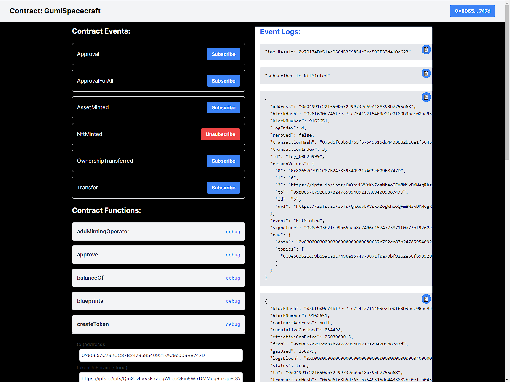

# Smart Contract Testing Application

Welcome to our Next.js project for testing smart contracts! This application allows you to interact with smart contracts in a simple and effective way. Whether you are a seasoned blockchain developer or just beginning your journey, this project can help facilitate your smart contract testing.

## Browser Support
Google Chrome

## Getting Started

First, install the project dependencies:

```bash
npm install
```

Next, create a `.env` file in the root directory and set the `API_URL` variable. This variable is the API endpoint for fetching the smart contract artifacts. If the variable is not set, the default endpoint is `http://localhost:8000/contract`.

Example:

```bash
echo "API_URL=http://my-api-url.com" > .env.local
```

Finally, start the development server:

```bash
npm run dev
```

Now you can open [http://localhost:3000](http://localhost:3000) in your browser to see the result.

## Modify Contract Artifacts

The component in `data/ContractArtifact.tsx` is responsible for fetching the contract artifacts from the API. The fetched artifact must conform to the `Contract` interface defined in the same file. Here's how the `Contract` interface looks like:

```typescript
interface Contract {
  // Database id - not needed by the app. Can be removed or set to 0 if necessary
  id: number;

  // Contract info
  name: string;
  address: string;

  // Hardhat build artifact
  artifact: any;
}
```

The `fetchContractArtifact` function fetches the contract artifact from the API. If you need to modify the returned object, you can do so in the `fetchContractArtifact` function. The function must return a promise that resolves to an object conforming to the `Contract` interface.

Example:

```typescript
export async function fetchContractArtifact(contractName: string): Promise<Contract> {
  try {
    const response = await axios.get<Contract>(`${apiHost}/${contractName}`);
    // Modify the response.data here if necessary
    return response.data;
  } catch (error) {
    console.error(error);
    throw error;
  }
}
```
## UI View



We hope this project will help you to test your smart contracts more effectively. If you have any questions or issues, feel free to open an issue in this repository. Happy coding!
